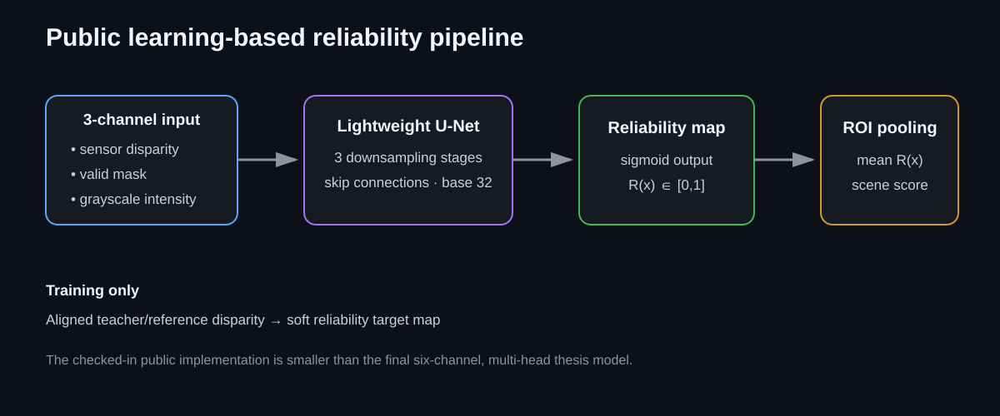
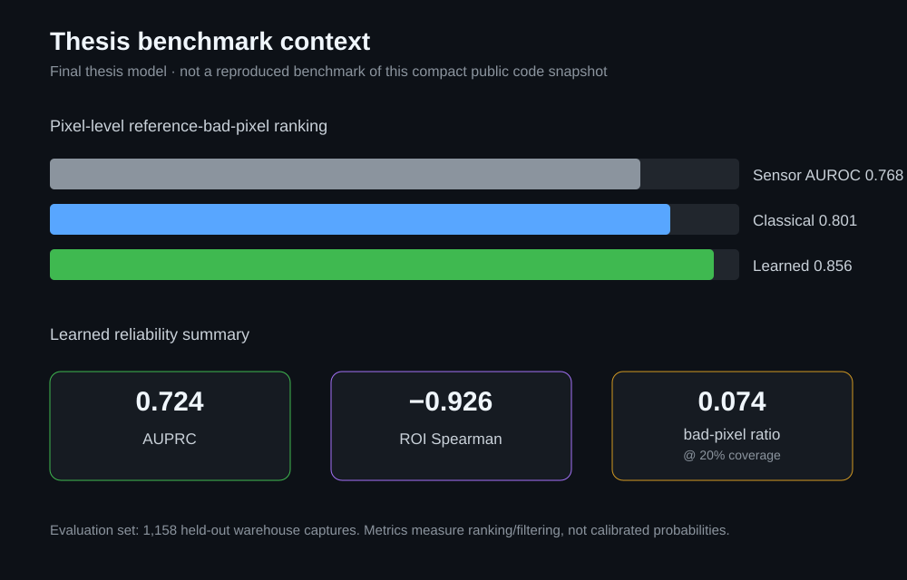
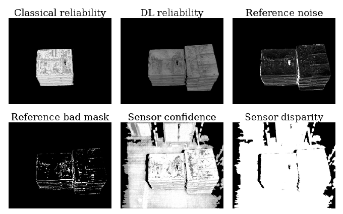
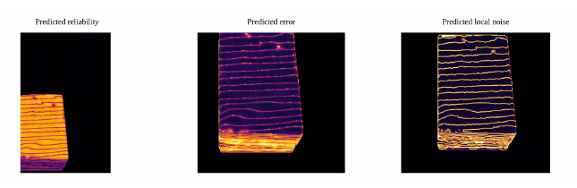
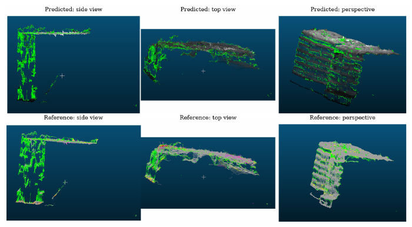

# Learning-Based Disparity Reliability

A compact PyTorch implementation for predicting dense disparity reliability and an object-level reliability score from sensor-side inputs.

This repository is related to the learning-based method developed in my Master's thesis, **Depth Data Quality and Reliability Assessment for Warehouse Environments**. It focuses on the same core problem: detecting unreliable stereo disparity **before** downstream 3D processing.

> **Repository scope:** the code currently published here is a compact public implementation with a 3-channel input and a single reliability-map output. The final thesis model used a broader six-channel, multi-head formulation. Thesis benchmark numbers below are therefore provided as research context and should not be interpreted as measurements reproduced by this exact public code snapshot.

<p align="center">
  
</p>

## Why reliability prediction?

A stereo disparity map can look plausible while containing missing pixels, local shape errors, boundary failures, or spatially coherent regions with large reference error. Sensor confidence alone does not always capture these failure modes.

The model learns a spatial reliability map so that:

- unreliable pixels receive lower values,
- reliable pixels receive higher values,
- the dense map can be pooled over the object ROI into one scene-level quality score.

## Public implementation in this repository

The current `ReliabilityUNet` is a lightweight encoder-decoder with skip connections:

```text
input: [sensor disparity, sensor-valid mask, grayscale intensity]
                       |
                    U-Net
                       |
              sigmoid reliability map
                       |
             mean inside object ROI
                       |
                ROI reliability score
```

The default model uses:

- **3 input channels**
- **1 output channel**
- base width **32**
- three downsampling stages
- bilinear upsampling with skip connections
- sigmoid output in `[0, 1]`

The implementation is in [`models/reliability_unet.py`](models/reliability_unet.py).

## Training target in this public snapshot

For the code currently in this repository, an aligned RAFT/deep-stereo disparity is used during target generation. On pixels where both disparities are valid:

\[
R_\text{target}(x)=\mathrm{clip}\left(1-\frac{|D_s(x)-D_r(x)|}{T},0,1\right)
\]

where \(D_s\) is sensor disparity, \(D_r\) is the aligned reference/teacher disparity used by this public implementation, and \(T\) is the configured reliability-error scale.

The reference/teacher disparity is used to build training targets. It is **not** part of the runtime model input.

## Inference

At runtime the model uses only sensor-side information:

1. load grayscale intensity and sensor disparity,
2. obtain an object ROI,
3. crop/resize the ROI region,
4. build the 3-channel input,
5. predict the dense reliability map,
6. average reliability inside the ROI to produce one object-level score.

The inference entry point is [`infer_checkpoint.py`](infer_checkpoint.py).

## Thesis benchmark context

The final thesis model was evaluated on **1,158 held-out warehouse captures** using ToF-based reference disparity for evaluation. The learned reliability output gave the strongest reference-bad-pixel ranking among the compared quality signals.

<p align="center">
  
</p>

| Quality signal | AUROC | AUPRC |
|---|---:|---:|
| Sensor confidence | 0.768 | 0.559 |
| Classical reliability | 0.801 | 0.623 |
| **Learned reliability** | **0.856** | **0.724** |

For complete-object ranking, the learned ROI score had:

- **Pearson:** -0.914
- **Spearman:** -0.926

with ROI bad-pixel ratio. The negative sign is expected: higher reliability corresponds to fewer bad pixels.

At **20% retained coverage**, the mean bad-pixel ratio was:

- sensor confidence: **0.170**
- classical reliability: **0.126**
- learned reliability: **0.074**

These are ranking/filtering results from the final thesis evaluation, not calibrated probabilities and not proof of end-to-end volume-estimation accuracy.

## Repository structure

```text
data/
  reliability_dataset.py     # scene indexing and model-input preparation
  target_builder.py          # aligned training-target construction
detection/
  runtime_roi.py             # ROI extraction
models/
  reliability_unet.py        # lightweight U-Net
training/
  losses.py                  # dense + ROI-level objectives
train_minimal.py             # compact training loop
eval_checkpoint.py           # validation metrics + qualitative outputs
infer_checkpoint.py          # runtime inference
scripts/
  visualize_targets.py
  debug_dataset.py
  debug_model.py
```

## Training

Typical setup:

```bash
python3 -m venv .venv
source .venv/bin/activate
pip install torch numpy opencv-python ultralytics scipy
```

Example:

```bash
python train_minimal.py \
  --dataset-root /path/to/training/data \
  --yolo-model /path/to/yolo_roi.pt \
  --crop-enabled \
  --resize-h 512 \
  --resize-w 512 \
  --batch-size 4 \
  --device cuda
```

The trainer saves checkpoints, epoch history, and debug predictions.

## Evaluation

```bash
python eval_checkpoint.py \
  --checkpoint /path/to/checkpoint.pt \
  --dataset-root /path/to/evaluation/data \
  --yolo-model /path/to/yolo_roi.pt \
  --output-dir outputs/eval
```

The evaluation code reports ROI-score error/correlation and writes per-sample scores plus qualitative predicted/target reliability maps.

## Inference

```bash
python infer_checkpoint.py \
  --checkpoint /path/to/checkpoint.pt \
  --input-root /path/to/scenes \
  --yolo-model /path/to/yolo_roi.pt \
  --output-dir outputs/infer \
  --device cuda
```

Runtime outputs include:

- predicted reliability heatmap,
- ROI mask,
- optional input-disparity visualization,
- intensity/ROI overlay,
- JSON with the predicted ROI score.

## Important distinction from the final thesis model

The final thesis learning-based approach used a richer **six-channel input** derived from sensor disparity and ROI information and a **multi-head output formulation**. It was supervised with ToF-based reference information during training/evaluation.

This repository currently exposes a smaller single-head implementation intended to keep the learning pipeline understandable and runnable. I keep this distinction explicit so that the repository does not overstate what the checked-in code reproduces.

## Limitations

- Reliability depends on the target/reference formulation used during training.
- Generalization to a new sensor, camera geometry, warehouse, or object distribution should be validated rather than assumed.
- ROI averaging can hide small localized failures.
- A high reliability score assesses the disparity input; it does not guarantee that segmentation, calibration, 3D reconstruction, or measurement stages will succeed.

## Thesis context

**M.Sc. Mechanical Engineering, specialization Mechatronics**  
Universität Duisburg-Essen

Thesis: *Depth Data Quality and Reliability Assessment for Warehouse Environments*

This repository contains a compact public implementation related to the learning-based branch of the thesis work.
## Qualitative thesis examples

The following figures are from the final thesis evaluation and illustrate the richer final thesis model, not a benchmark reproduced by the compact public implementation in this repository.

<p align="center">
  
</p>

This held-out warehouse example compares classical and learned reliability with sensor confidence, sensor disparity, and reference-defined diagnostic masks. The reference information is used for evaluation, not as a runtime model input.

<p align="center">
  
</p>

The final thesis model predicts complementary dense outputs. Low predicted reliability and elevated predicted error/instability concentrate around object regions that are risky for downstream 3D reconstruction.

<p align="center">
  
</p>

Projecting the diagnostic regions into 3D shows that many selected pixels correspond to noisy, flying, or misplaced points. This is a qualitative interpretation aid rather than proof of downstream volume-estimation improvement.

